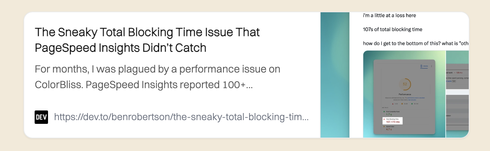

# gatsby-remark-pretty-link-card

## Description

Generate pretty link preview cards directly from Markdown or MDX using a simple shorthand. Write `[$card](https://example.com)` and this plugin will fetch the target page, extract Open Graph metadata, and render a responsive card with title, description, favicon, and preview image.

Inspired by [gatsby-remark-link-preview](https://www.gatsbyjs.com/plugins/gatsby-remark-link-preview/?=link%20card), but works without Puppeteer.

- Cards render as semantic HTML with class names prefixed by `pretty-link-card-*`.
- Minimal default CSS is shipped and auto-included by the plugin via `gatsby-browser.js`. You can override styles in your site’s CSS using the same class names.

No public demo site yet.

### Example



### Dependencies

- If you use Markdown via `gatsby-transformer-remark`, add this plugin under its `plugins` array.
- If you use `gatsby-plugin-mdx`, add this plugin under its `gatsbyRemarkPlugins` array.

### Learning Resources

- Gatsby Remark Plugins: https://www.gatsbyjs.com/docs/how-to/plugins-and-themes/using-a-plugin-in-your-site/
- MDX + Gatsby Remark Plugins: https://www.gatsbyjs.com/docs/how-to/routing/mdx/#using-gatsby-remark-plugins
- Open Graph overview: https://ogp.me/

## How to install

Install from npm:

```bash
npm install gatsby-remark-pretty-link-card
```

Then configure depending on your content pipeline.

Using `gatsby-transformer-remark`:

```js
// gatsby-config.js
module.exports = {
  plugins: [
    {
      resolve: "gatsby-transformer-remark",
      options: {
        plugins: [
          {
            resolve: "gatsby-remark-pretty-link-card",
            options: {
              // optional
              delimiter: "$card", // string used in markdown link text
              timeout: 15000, // fetch timeout in ms
            },
          },
        ],
      },
    },
  ],
};
```

Using `gatsby-plugin-mdx`:

```js
// gatsby-config.js
module.exports = {
  plugins: [
    {
      resolve: "gatsby-plugin-mdx",
      options: {
        gatsbyRemarkPlugins: [
          {
            resolve: "gatsby-remark-pretty-link-card",
            options: {
              delimiter: "$card",
              timeout: 15000,
            },
          },
        ],
      },
    },
  ],
};
```

The plugin automatically includes a small stylesheet via `gatsby-browser.js` (`styles.css`). No extra steps are required.

## Available options (if any)

- `delimiter` (string, default: `$card`): The exact text inside the Markdown link that triggers a card. Example: `[$card](https://example.com)`.
- `timeout` (number, default: `15000`): Timeout in milliseconds for fetching remote HTML to extract metadata.

## When do I use this plugin?

Use this when you want quick, attractive link previews in blog posts or docs without manually curating images and summaries. It’s handy for “further reading” sections, bookmarks, or inline references.

## Examples of usage

In Markdown/MDX content:

```md
[$card](https://www.gatsbyjs.com)
```

This renders a card anchored to the link with classes like `pretty-link-card-container`, `pretty-link-card-title`, `pretty-link-card-description`, `pretty-link-card-url`, `pretty-link-card-image`, etc.

Styling: The plugin ships minimal defaults. Override any rule in your site CSS, e.g.:

```css
.pretty-link-card-container {
  border-color: #ddd;
}
.pretty-link-card-title {
  font-size: 1.125rem;
}
```

## How to develop locally

1. Clone the repo and install dependencies.
2. Make changes under the plugin directory.
3. Use `npm pack` or `npm link` to test in a local Gatsby site.

## How to contribute

Issues and pull requests are welcome. If you’re proposing a significant API change, please open an issue first to discuss the approach. Bug reports with reproduction steps or a minimal repo are greatly appreciated.
